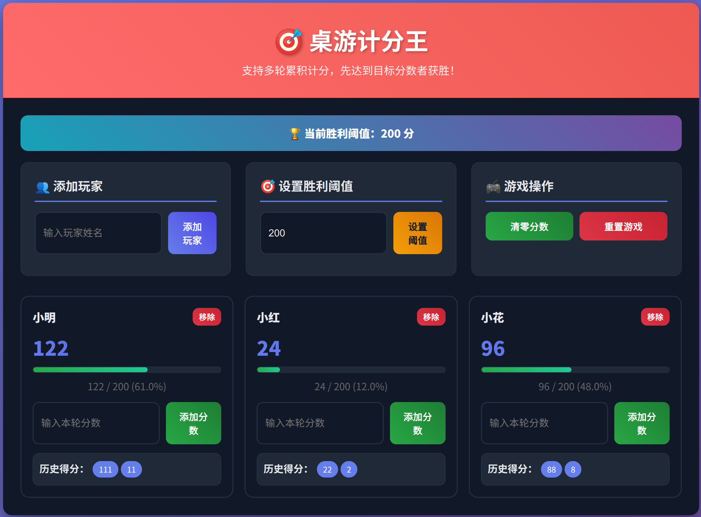
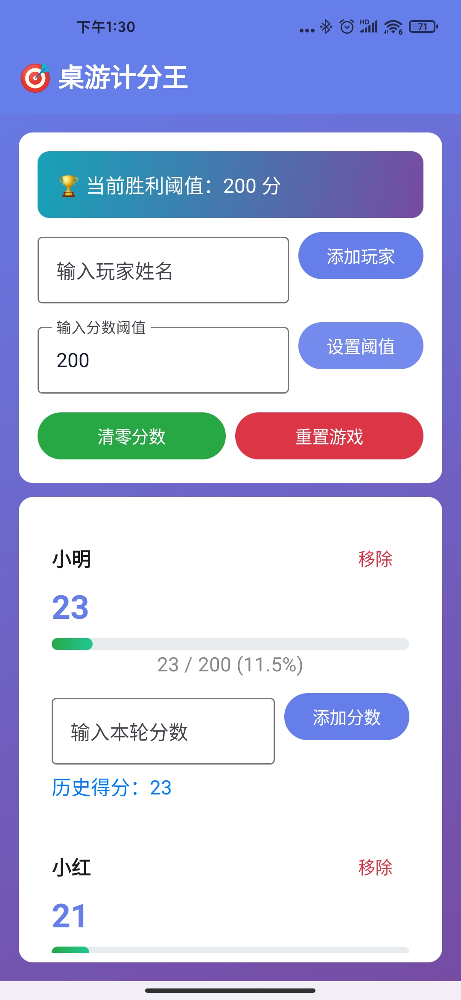

# 桌游计分王（Score King）


**一个包含 Web 与 Android App 的多人多轮计分项目**：
- Web（Flask + HTML/JS）：浏览器里桌游计分王（默认端口 8080）
- Android App（Kotlin + Jetpack Compose）：原生离线计分应用（应用名：score_king / 桌游计分王）

可以使用的桌游有：
- Flip7（7翻）
- Catan（卡坦岛）
- Splendor（璀璨宝石）
- Uno（乌诺）
- 等其他类似需要计分的桌游...

## Demo
- Web 版

- Android 版


## 功能
- 添加/移除玩家
- 多轮累积计分
- 设置胜利阈值（默认 200）
- 达阈值自动判定并提示
- 清零分数或重置游戏

## 快速开始

在开始之前，请先选择你的使用场景：
- 仅使用 Web 版：无需安装 JDK/Android SDK，直接跳到“Web 版”章节
- 构建/运行 Android 版：需要先完成下面的“环境准备”，这些步骤仅用于 Android 构建

### 环境准备（Linux）
说明：以下步骤用于 Android App 构建；仅使用 Web 版可跳过此节，直接前往“Web 版”。
- 安装 JDK 17 与常用工具：
  ```bash
  sudo apt-get update
  sudo apt-get install -y openjdk-17-jdk wget unzip
  ```
- 配置环境变量（当前会话测试）：
  ```bash
  export JAVA_HOME="/usr/lib/jvm/java-17-openjdk-amd64"
  export ANDROID_SDK_ROOT="$HOME/Android/Sdk"
  export PATH="$JAVA_HOME/bin:$ANDROID_SDK_ROOT/platform-tools:$ANDROID_SDK_ROOT/emulator:$ANDROID_SDK_ROOT/cmdline-tools/latest/bin:$PATH"
  java -version
  ```
- 安装 Android SDK 命令行工具与组件（首次执行需较长时间；详细指引见下方“Android SDK 下载与安装说明”）：
  ```bash
  # 如果缺少 sdkmanager，可先安装 Android Studio 并在 SDK Manager 勾选 Command-line Tools
  yes | sdkmanager --licenses --sdk_root="$ANDROID_SDK_ROOT"
  sdkmanager --sdk_root="$ANDROID_SDK_ROOT" \
    "platform-tools" "platforms;android-34" "build-tools;34.0.0" "cmdline-tools;latest"
  ```
- 持久化到 zsh：
  ```bash
  echo 'export ANDROID_SDK_ROOT="$HOME/Android/Sdk"' >> ~/.zshrc
  echo 'export JAVA_HOME="/usr/lib/jvm/java-17-openjdk-amd64"' >> ~/.zshrc
  echo 'export PATH="$JAVA_HOME/bin:$ANDROID_SDK_ROOT/platform-tools:$ANDROID_SDK_ROOT/emulator:$ANDROID_SDK_ROOT/cmdline-tools/latest/bin:$PATH"' >> ~/.zshrc
  source ~/.zshrc
  ```

### 环境准备（macOS）
说明：以下步骤用于 Android App 构建；仅使用 Web 版可跳过此节，直接前往“Web 版”。
- 安装 JDK 17（Homebrew）：
  ```bash
  brew install openjdk@17
  sudo ln -sfn /opt/homebrew/opt/openjdk@17/libexec/openjdk.jdk /Library/Java/JavaVirtualMachines/openjdk-17.jdk 2>/dev/null || true
  ```
- 配置环境变量（zsh）：
  ```bash
  echo 'export JAVA_HOME="/opt/homebrew/opt/openjdk@17"' >> ~/.zshrc
  echo 'export ANDROID_SDK_ROOT="$HOME/Library/Android/sdk"' >> ~/.zshrc
  echo 'export PATH="$JAVA_HOME/bin:$ANDROID_SDK_ROOT/platform-tools:$ANDROID_SDK_ROOT/emulator:$ANDROID_SDK_ROOT/cmdline-tools/latest/bin:$PATH"' >> ~/.zshrc
  source ~/.zshrc
  java -version
  ```
- 安装 Android SDK 组件（如缺少 sdkmanager，请先在 Android Studio 的 SDK Manager 勾选 Command-line Tools）：
  ```bash
  yes | sdkmanager --licenses --sdk_root="$ANDROID_SDK_ROOT"
  sdkmanager --sdk_root="$ANDROID_SDK_ROOT" \
    "platform-tools" "platforms;android-34" "build-tools;34.0.0" "cmdline-tools;latest"
  ```

### 环境准备（Windows）
说明：以下步骤用于 Android App 构建；仅使用 Web 版可跳过此节，直接前往“Web 版”。
- 安装 JDK 17 与 Android Studio：
  - 建议从 Oracle/OpenJDK 官方或使用包管理器（如 winget/choco）安装 JDK 17
  - 安装 Android Studio，并在 SDK Manager 中安装 "Android SDK Command-line Tools"
- 配置环境变量（PowerShell，以用户环境为例）：
  ```powershell
  # 按实际安装路径修改
  setx JAVA_HOME "C:\\Program Files\\Java\\jdk-17"
  setx ANDROID_SDK_ROOT "%USERPROFILE%\\AppData\\Local\\Android\\Sdk"
  setx PATH "%JAVA_HOME%\\bin;%ANDROID_SDK_ROOT%\\platform-tools;%ANDROID_SDK_ROOT%\\emulator;%ANDROID_SDK_ROOT%\\cmdline-tools\\latest\\bin;%PATH%"
  # 重新打开一个新的 PowerShell 窗口后生效
  java -version
  ```
- 安装 SDK 组件（在新开的 PowerShell 窗口）：
  ```powershell
  sdkmanager --licenses --sdk_root "%ANDROID_SDK_ROOT%"
  sdkmanager --sdk_root "%ANDROID_SDK_ROOT%" "platform-tools" "platforms;android-34" "build-tools;34.0.0" "cmdline-tools;latest"
  ```

### Web 版
要求：Python 3.9+（建议使用虚拟环境）

```bash
# 1) 创建并激活虚拟环境
python3 -m venv .venv
source .venv/bin/activate

# 2) 安装依赖
pip install -r requirements.txt

# 3) 启动（任选其一）
python run.py
# 或
python app.py

# 访问: http://localhost:8080
```

### Android 版
方式一（推荐）：使用 Android Studio
1) 打开 Android Studio → Open → 选择 `android_app/`
2) 等待 Gradle 同步
3) Build → Build APK(s)
4) APK 输出路径：`android_app/app/build/outputs/apk/debug/app-debug.apk`

方式二：命令行构建（可复现）
```bash
# 1) 确保使用 Java 17
export JAVA_HOME="/usr/lib/jvm/java-17-openjdk-amd64"
export PATH="$JAVA_HOME/bin:$PATH"
# 确保 ANDROID_SDK_ROOT 指向已安装的 Android SDK 目录（如已在上文持久化可忽略）
export ANDROID_SDK_ROOT="$HOME/Android/Sdk"

# 2) 构建 APK
cd android_app
./gradlew assembleDebug
# 输出: app/build/outputs/apk/debug/app-debug.apk
```

如需一键脚本（已提供）：
```bash
cd android_app
./build-apk.sh
```
该脚本会优先使用 Gradle Wrapper；若缺失，则尝试使用已安装的 `gradle` 生成。

### 常见问题（Android 构建）
- Gradle 下载超时：本仓库已将 `android_app/gradle/wrapper/gradle-wrapper.properties` 的 `distributionUrl` 指向镜像源；如需切换，可修改为可用的镜像地址。
- JVM 版本错误：Gradle 9 需要 Java 17+；请确认 `java -version` 输出为 17 及以上，并设置了正确的 `JAVA_HOME`。
- 找不到 sdkmanager：请在 Android Studio 的 SDK Manager 勾选 “Android SDK Command-line Tools”，或确认 `ANDROID_SDK_ROOT` 指向正确目录。

### Android SDK 下载与安装说明
- 方式一（推荐）：通过 Android Studio 图形界面
  - 打开 Android Studio → More Actions → SDK Manager
  - Android SDK → 选中并安装：
    - Android SDK Platform-Tools（platform-tools）
    - Android SDK Platform 34（platforms;android-34）
    - Android SDK Build-Tools 34.0.0（build-tools;34.0.0）
    - Android SDK Command-line Tools（cmdline-tools;latest）
  - SDK 目录即 `ANDROID_SDK_ROOT`：
    - Linux：`$HOME/Android/Sdk`
    - macOS：`$HOME/Library/Android/sdk`
    - Windows：`%USERPROFILE%\AppData\Local\Android\Sdk`

- 方式二：命令行下载并安装
  1) 获取 Command-line Tools 压缩包（按系统选择）：
     - Linux：`https://dl.google.com/android/repository/commandlinetools-linux-latest.zip`
     - macOS：`https://dl.google.com/android/repository/commandlinetools-mac-2024-04.zip` 或 `commandlinetools-mac-latest.zip`
     - Windows：`https://dl.google.com/android/repository/commandlinetools-win-2024-04.zip` 或 `commandlinetools-win-latest.zip`
     - 网络受限可选择国内镜像站点（请按镜像提供方文档选择对应路径）。
  2) 解压到规范目录（注意必须是 `cmdline-tools/latest` 结构）：
     - Linux/macOS：
       ```bash
       mkdir -p "$ANDROID_SDK_ROOT/cmdline-tools"
       unzip commandlinetools-*-latest.zip -d "$ANDROID_SDK_ROOT"
       mv "$ANDROID_SDK_ROOT/cmdline-tools" "$ANDROID_SDK_ROOT/cmdline-tools/latest" 2>/dev/null || \
       mv "$ANDROID_SDK_ROOT/cmdline-tools"/* "$ANDROID_SDK_ROOT/cmdline-tools/latest" 2>/dev/null || true
       ```
     - Windows：将压缩包内容解压至 `%ANDROID_SDK_ROOT%\cmdline-tools\latest\`
  3) 使用 sdkmanager 接受协议并下载组件：
     ```bash
     yes | sdkmanager --licenses --sdk_root="$ANDROID_SDK_ROOT"
     sdkmanager --sdk_root="$ANDROID_SDK_ROOT" \
       "platform-tools" "platforms;android-34" "build-tools;34.0.0" "cmdline-tools;latest"
     ```
  4) 网络受限时的代理设置（可选）：
     - Linux/macOS：
       ```bash
       export HTTPS_PROXY=http://127.0.0.1:7890
       export HTTP_PROXY=http://127.0.0.1:7890
       ```
     - Windows（PowerShell，新窗口生效）：
       ```powershell
       setx HTTPS_PROXY http://127.0.0.1:7890
       setx HTTP_PROXY http://127.0.0.1:7890
       ```

## 目录结构
```
score_king_app/
├── app.py                  # Flask 应用
├── run.py                  # 启动器
├── templates/index.html    # Web 界面
├── android_app/            # Android 应用
│   ├── app/src/...         # 源码
│   ├── gradlew*            # Gradle Wrapper（已包含）
│   └── build-apk.sh        # 一键构建脚本
├── requirements.txt        # Web 依赖
└── README.md               # 中文说明（默认）
```

## 发布到 GitHub Release（含 APK）
本仓库已配置自动发布流程：在推送形如 `vX.Y.Z` 的 tag 时，GitHub Actions 将自动构建 Android Debug APK 并创建 Release，附带 `app-debug.apk`。

### 一次性准备
- 确认你对仓库有 `contents: write` 权限（用于创建 Release）。
- 可编辑根目录 `RELEASE_NOTES.md` 作为本次发布的说明体（工作流会引用它）。

### 发布步骤
```bash
# 1) 更新版本号（可选，位于 android_app/app/build.gradle.kts 的 versionName/versionCode）

# 2) 提交代码
git add -A && git commit -m "chore: release vX.Y.Z"

# 3) 打标签并推送
git tag vX.Y.Z
git push origin vX.Y.Z

# 4) 等待 GitHub Actions 完成（2-8 分钟）
#    完成后会在 Releases 中看到本次发布，附件含 APK
```

说明：当前工作流打包 `debug` APK，签名为调试签名，适合测试分发。如需发布 `release` APK 并使用自有签名，请：
- 在 `android_app/app/build.gradle.kts` 中配置 `signingConfigs` 与 `buildTypes.release` 的签名；
- 修改工作流 `.github/workflows/release.yml` 将构建命令改为 `./gradlew assembleRelease`，并上传 `app-release.apk`；
- 将签名 keystore/密钥放入 GitHub Secrets，并在构建时注入。

## ANDROID_SDK_ROOT 说明
- Linux 常用位置：`$HOME/Android/Sdk`
- macOS 常用位置：`$HOME/Library/Android/sdk`
- 如果 `sdkmanager` 未安装：
  - 打开 Android Studio → More Actions → SDK Manager → 勾选 “Android SDK Command-line Tools”

## License
本项目采用 MIT License 开源，详见仓库中的 `LICENSE` 文件。